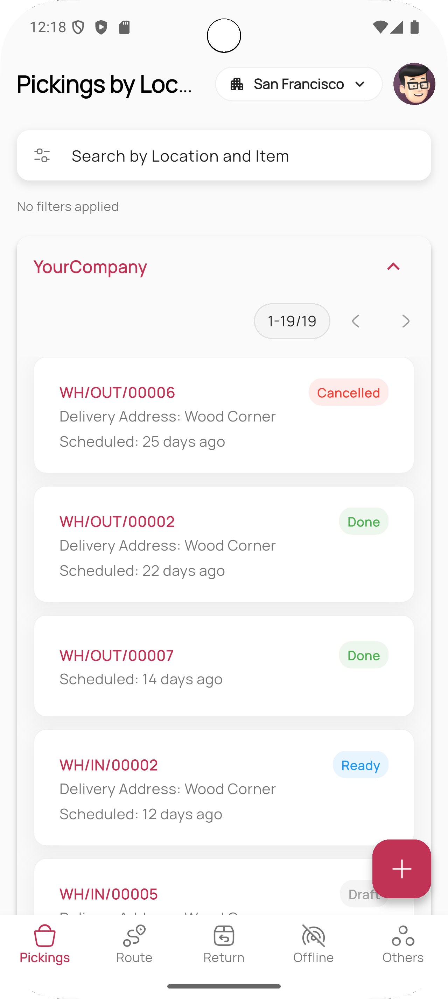
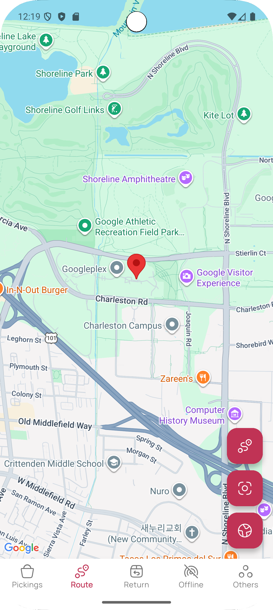
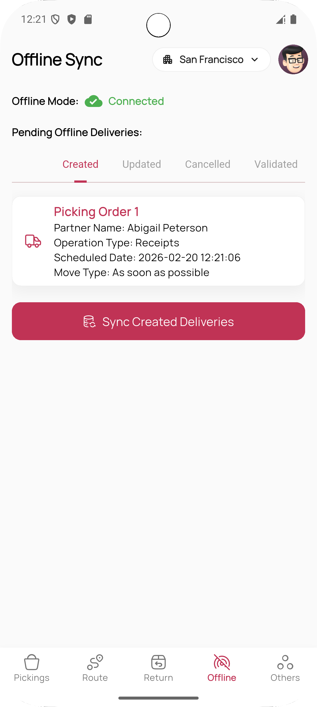

# Mobo Delivery


**Mobo Delivery** is a powerful, offline-first mobile application built with Flutter that transforms
how delivery teams interact with Odoo. Designed specifically for drivers, warehouse staff, and
logistics coordinators, it brings real-time route planning, live navigation, digital signatures,
document attachments, and robust offline synchronization directly to your phone — even in areas with
poor connectivity.

## Key Features

### Real-Time Route Planning & Navigation

- **Optimized Multi-Stop Routes** — Automatically build delivery routes from selected Odoo pickings
- **Live GPS Tracking** — Custom blue-dot marker with bearing (gyroscope-assisted rotation)
- **Google Maps Integration** — Driving, biking, walking modes + leg-by-leg remaining distance/time
- **Off-Route Detection & Alerts** — Visual + audio feedback when deviating from route
- **Add Stops On-the-Fly** — Extend routes during delivery

### Delivery Proof & Documentation

- **Digital Signature Capture** — Draw or upload signatures directly in-app
- **Attach Documents** — Upload photos, PDFs, delivery notes, PODs (proof of delivery)
- **Picking Notes** — Add internal remarks visible to warehouse & accounts teams

### Offline-First Logistics

- **Full Offline Support** — Create, update, validate, cancel deliveries without internet
- **Smart Sync Queue** — Pending validations, cancellations, updates, new deliveries, product
  changes
- **Offline Status Dashboard** — Clear overview of queued actions + one-tap sync when online

### Inventory & Picking Integration

- **Picking Management** — View, edit notes, attach documents to transfers/receipts/deliveries
- **Status Filtering & Grouping** — To Do, My Transfers, Late, Backorders, Warnings + more
- **Real-Time Stock Moves** — Track movement history even offline

### Security & Usability

- **Biometric Login** — Fingerprint / Face ID for fast, secure access
- **Multi-Company Switching** — Seamlessly work across different Odoo companies
- **Dark Mode & Motion Reduction** — Comfortable usage in low light + accessibility-friendly
- **Beautiful UI** — Modern cards, Lottie animations, HugeIcons, smooth transitions

## Screenshots

<div>
  
  
  
  
</div>

## Technology Stack

- **Frontend**: Flutter (Dart)
- **State Management** — Provider + BLoC
- **Offline Storage** — Hive
- **Maps & Navigation** — google_maps_flutter + Google Directions API
- **Signature Capture** — signature package
- **File Picking** — file_picker
- **Backend Integration**: Odoo JSON-RPC
- **Connectivity** — connectivity_plus
- **Audio Feedback** — audioplayers
- **UI Polish** — HugeIcons, Lottie, motion reduction support
- **Authentication**: Local Auth (Biometrics) & Odoo Session Management

## Getting Started

### Prerequisites

- Flutter SDK (Latest Stable)
- Odoo Instance (v14 or higher recommended)
- Google Maps API key (with Directions & Places enabled)
- Android Studio or VS Code

### Installation

1. **Clone the repository**
   ```bash
   git clone https://github.com/mobo-suite/mobo_delivery.git
   cd mobo_delivery
   ```

2. **Install dependencies**
   ```bash
   flutter pub get
   ```

3. **Generate code (Hive adapters, JSON serialization, etc.)**
   ```bash
   dart run build_runner build --delete-conflicting-outputs
   ```

4. **Add your Google Maps API key**
   **Android**  
   Open `android/app/src/main/AndroidManifest.xml` and add the following inside the `<application>`
   tag:

   ```xml
   <meta-data
       android:name="com.google.android.geo.API_KEY"
       android:value="YOUR_GOOGLE_MAPS_API_KEY_HERE"/>
   ```
   **iOS**
   Open `ios/Runner/Info.plist` and add these keys:

    ```xml
   <key>io.flutter.embedded_views_preview</key>
   <true/>
   
   <key>NSLocationWhenInUseUsageDescription</key>
   <string>We need your location for live navigation and route planning.</string>
   
   <key>com.google.maps.api.key</key>
   <string>YOUR_GOOGLE_MAPS_API_KEY_HERE</string>
   ```

5. **Run the application**
   ```bash
   flutter run
   ```

## Configuration

1. **Server Connection**: Upon first launch, enter your Odoo server URL and database name.
2. **Authentication**: Log in using your Odoo credentials. Biometric login can be enabled from
   settings.

## License

See the [LICENSE](LICENSE) file for the main license and [THIRD_PARTY_LICENSES.md](THIRD_PARTY_LICENSES.md) for details on included dependencies and their respective licenses.

##  Maintainers
**Team Mobo at Cybrosys Technologies**
- Email: [cybroplay@gmail.com](mailto:cybroplay@gmail.com)
- Website: [cybrosys.com](https://www.cybrosys.com)